# vibelint

**Find the mistakes AI leaves behind in your code.**

Your ai assistant writes code that imports cleanly, reads well, and looks finished. Some of it does nothing. `vibelint` runs over a Python project like a test suite and reports every place the model invented an API, left a function unwritten, swallowed an error, or produced a test that cannot fail.

<p align="center">
  
</p>

In full (not `--quiet`) it shows the offending line and what to do about it:

```console
$ vibelint examples/vibe_coded_app

  app.py
      3  x  GHOST IMPORT      `fastjson` does not exist: not in the standard library, not
                              installed, not part of this project, and not in your dependencies
         |  import fastjson
         -> Check the real package name before installing anything with this name -
            attackers register hallucinated package names on PyPI.

     13  x  GHOST FUNCTION    `sanitize_input()` is not defined anywhere in this project
         |  clean_order = sanitize_input(order)

     27  x  LOST AWAIT        send_email() is async, but it is called without `await`,
                              so its body never runs
         |  services.send_email(
         -> Write `await send_email(...)`.

  tests/test_orders.py
     14  x  TEST THEATER      test_truncate_long_text() runs code but never asserts anything,
                              so it can only fail if the code crashes
     21  x  FAKE ASSERT       `assert 1 == 1` is true no matter what the code does

  ────────────────────────────────────────────────────────────
  25 flops  ·  15 critical  ·  10 warning  ·  5 of 5 files affected
  checked in 0.18s
```

## Why this is not just another linter

Existing linters check *style* and *syntax* — things a human gets wrong. Generated code fails differently. It is syntactically perfect and semantically hollow.

Nothing else catches these, because until recently nothing wrote them at scale:

- A test that sets up an elaborate scenario and then asserts nothing.
- A function with a thorough docstring describing behaviour it does not have.
- `client.send_json()` — a method name so plausible you never think to check it exists.
- `# In a real implementation, you would validate the token here` — shipped to production.

## Install

```bash
pip install vibelint
```

Zero dependencies. Python 3.9+. It never runs, imports, or evaluates the code it analyses — everything is read from the syntax tree.

## Use

```bash
vibelint                   # check the current directory
vibelint src/              # check one directory
vibelint app.py            # check a single file

vibelint --only VC040      # only test-theater findings
vibelint --ignore VC030    # hide a rule you disagree with
vibelint --json            # machine-readable, for CI
vibelint --list            # describe every check
```

Silence a single line:

```python
result = risky()  # vibelint: ignore
result = risky()  # noqa: VC030
```

Exit codes: `0` clean, `1` findings at or above `--fail-on` (default `warning`), `2` usage error.

## What it catches

| Code | Check | What it means |
|---|---|---|
| `VC001` | GHOST IMPORT | Package does not exist anywhere — not stdlib, not installed, not declared, not local |
| `VC002` | GHOST FUNCTION | A call to a function that was never written |
| `VC003` | GHOST METHOD | A method that does not exist on the module it is called on |
| `VC010` | PLACEHOLDER | A function with a docstring and no implementation |
| `VC011` | MODEL CONFESSION | A comment where the model admits the code is not real |
| `VC020` | FAKE VALUE | Placeholder credentials wired into live code |
| `VC021` | FAKE ENDPOINT | `example.com` used as a real service |
| `VC022` | FAKE FALLBACK | `os.getenv("KEY", "your-key-here")` — fails silently in production |
| `VC030` | SILENT FAIL | Errors caught and discarded |
| `VC031` | SWALLOWED RETURN | `return` inside `finally`, which throws away the exception |
| `VC040` | TEST THEATER | A test that asserts nothing and cannot fail |
| `VC041` | FAKE ASSERT | `assert True` — true regardless of the code |
| `VC042` | MOCK TAUTOLOGY | A test that only asserts on values it mocked itself |
| `VC050` | LOST AWAIT | An async function called without `await`, so it never runs |
| `VC051` | BLOCKING ASYNC | `time.sleep()` inside `async def`, freezing the event loop |

## It stays quiet on good code

A linter that cries wolf gets uninstalled. Every rule is calibrated against real, mature, human-written code rather than tuned only to catch things.

Across **241 files of `pip` and `setuptools` source**, vibelint reports **2 critical findings**. Nearly all of the remaining output is `VC030` — real error-swallowing that is genuinely there.

Getting to that number meant teaching the checks about how Python is actually written:

- `raise NotImplementedError` in a base class is informal abstract, not an unfinished job.
- `except KeyboardInterrupt:` **with a real handler body** is correct; only discarding it is a bug.
- `try: import tomllib / except ImportError: import tomli` is a compatibility shim, not a hallucination.
- A package in `requirements.txt` but not installed is your setup, not the model's invention.
- Vendored directories are somebody else's code and are skipped.

## Speed

The whole Python standard library - **680 files, 306,000 lines** - takes about
27 seconds on a laptop, or roughly 11,000 lines a second. A normal project is
a fraction of that: a few thousand lines finishes before you lift your hand off
the keyboard.

Each file is parsed once and its nodes bucketed by type, so adding a sixteenth
check costs almost nothing - the tree is already walked.

## In CI

```yaml
- name: vibelint
  run: |
    pip install vibelint
    vibelint . --fail-on critical
```

## How it works

1. **Index** — parse every file and record what the project genuinely defines: functions, classes, methods, class hierarchies, async definitions.
2. **Check** — walk each file once, bucket the nodes by type, and run all fifteen rules against that shared view.
3. **Report** — group findings by file, ranked by severity, each with the offending line and a concrete fix.

The index is what makes ghost detection possible: no single file can tell you whether `helpers.format_date()` is real, but the whole project can.

## Roadmap

- **JavaScript / TypeScript.** The flops are identical in every language — only the parser is Python-specific, and the checks are deliberately separated from parsing.
- Editor integration, so findings appear as you accept a suggestion rather than afterwards.
- Config file for per-project severity overrides.

## Contributing

A new rule is one `Check` subclass and one line in the registry. The bar for merging: it must fire on generated code and stay silent on `pip` and `setuptools`.

```bash
git clone <repo> && cd vibelint
pip install -e ".[dev]"
python -m pytest tests/ -q
vibelint examples/vibe_coded_app     # should report 25 flops
```

The README demo and the social card are both generated from the tool's real
output, so they cannot drift from what it actually prints:

```bash
python3 tools/make_demo.py      # -> demo.svg
python3 tools/make_social.py    # -> social-preview.png  (macOS)
```

## License

MIT
